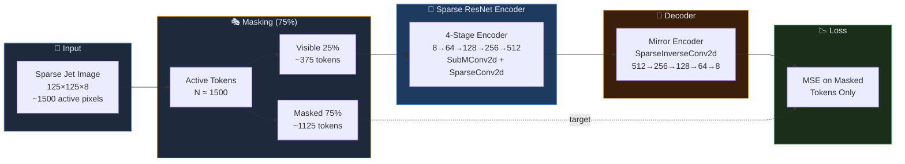
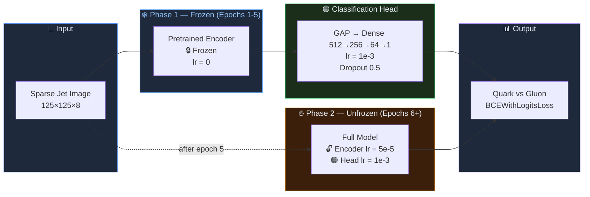
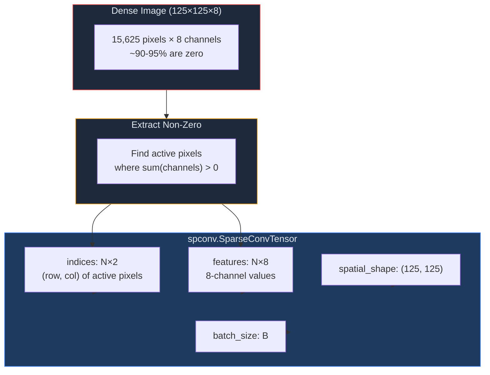
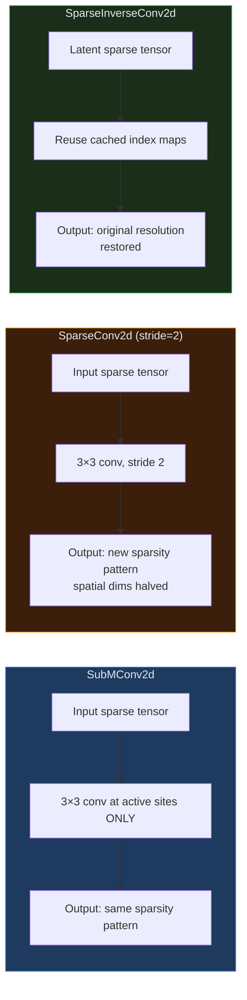
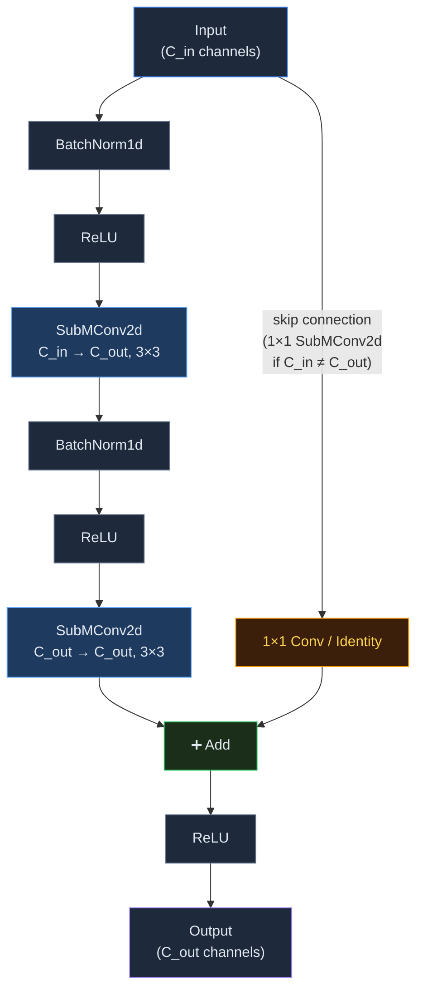
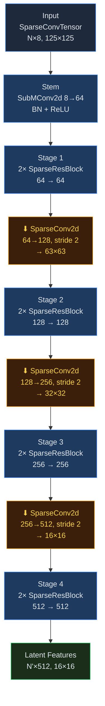
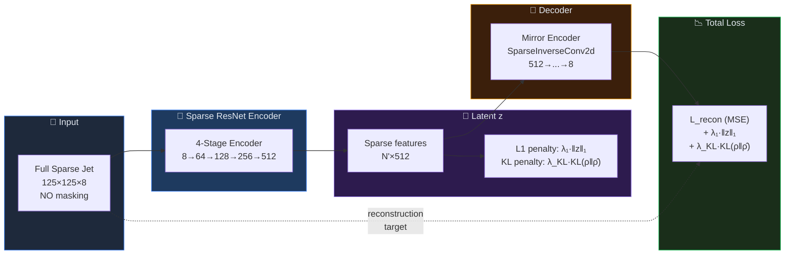
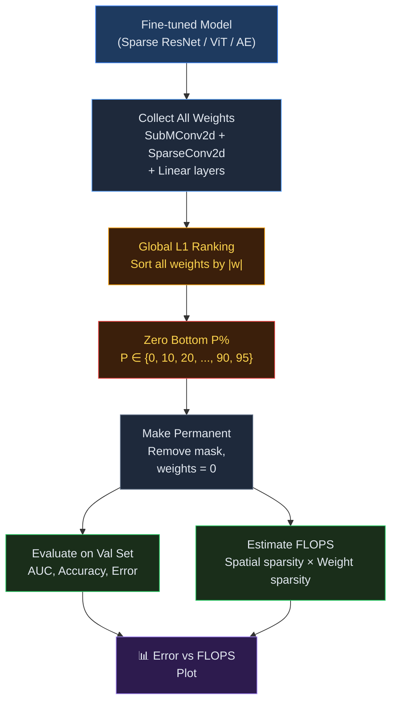

# Mermaid Diagrams for E2E Repo
# Copy each ```mermaid block into the appropriate README

---

## 1. MAE Pretraining Pipeline (Main README)



---

## 2. Fine-tuning Pipeline (Main README)



---

## 3. Sparse Tensor Data Structure (SparseConvolutions README)



---

## 4. Sparse Convolution Primitives (SparseConvolutions README)



---

## 5. SparseResBlock (SparseConvolutions README)



---

## 6. Full Sparse ResNet Encoder (SparseConvolutions README)



---

## 7. Sparse Autoencoder Pipeline (SparseAutoencoder README)



---

## 8. Pruning Methodology Flow (pruning README)


