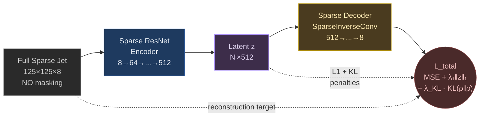
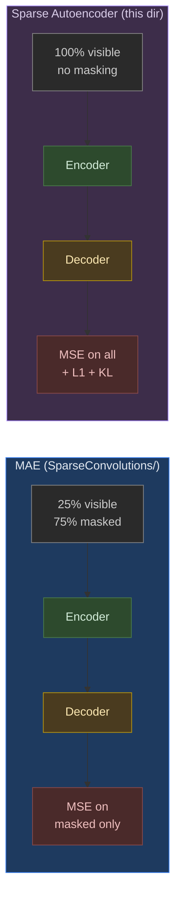
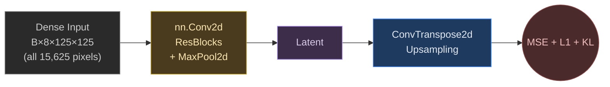

# Sparse Autoencoder for Jet Classification

This directory explores an alternative to Masked Autoencoding: a traditional **sparse autoencoder** with L1 sparsity and KL divergence regularization on the latent space.

---

## Approach

Instead of masking tokens and reconstructing them (MAE), the sparse autoencoder encodes the **full** jet image (no masking), decodes to reconstruct the original, and adds **L1 + KL** penalties on the latent activations.



### Loss Function

```
L_total = L_recon (MSE) + λ_L1 · ||z||₁ + λ_KL · KL(ρ || ρ̂)
```

| Term | Purpose | Typical magnitude (epoch 1) |
|:-----|:--------|:---------------------------:|
| **L_recon (MSE)** | Faithful reconstruction | ~0.014 |
| **λ_L1 · ‖z‖₁** | Sparse latent activations | ~1e-6 |
| **λ_KL · KL(ρ ‖ ρ̂)** | Push avg activation toward target ρ | ~4e-6 |

### MAE vs. Sparse Autoencoder



---

## Experiments

### Sparse_ResNet/

Uses the same Sparse ResNet encoder as the convolution-based models, pretrained with the autoencoder objective (L1 + KL) instead of MAE.

| Metric | Value |
|:-------|:-----:|
| **AUC** | 0.9341 |
| **Accuracy** | 0.869 |
| **F1** | 0.871 |
| **1/FPR @ TPR=0.7** | 14.1 |

This is the weakest-performing model (**ΔAUC = −0.0268** vs. the best MAE model), suggesting masking-based pretext tasks learn more transferable representations.

### dense_resnet_sae/

A **dense (non-sparse) ResNet autoencoder** baseline. Uses standard `nn.Conv2d` instead of `spconv.SubMConv2d`, operating on the full 125×125×8 grid including zero pixels.



---

## Key Observation

The L1 and KL losses are **orders of magnitude smaller** than reconstruction loss (~1e-6 vs. ~0.014), suggesting the regularization terms are too weak to meaningfully shape representations. Increasing `λ_L1` and `λ_KL` by 2–3 orders of magnitude could improve results.

### Why MAE Outperforms

| Aspect | MAE | Sparse Autoencoder |
|:-------|:----|:-------------------|
| **Information bottleneck** | Strong — only 25% visible | Weak — full input |
| **Pretext difficulty** | Hard — infer missing structure | Easy — input ≈ output |
| **Representation quality** | Contextual, predictive features | Identity-like mappings |
| **Regularization** | Implicit (masking) | Explicit but undertuned |

---

## File Structure

```
├── Sparse_ResNet/
│   ├── pretrain.py              # Autoencoder pretraining (L1 + KL)
│   ├── finetune.py              # Supervised fine-tuning
│   ├── pretrain_history.json    # Per-epoch losses (total, recon, L1, KL)
│   ├── finetune_history.json
│   ├── finetune_metrics.json
│   └── *.jpg                    # Training plots
└── dense_resnet_sae/
    ├── pretrain.py              # Dense autoencoder baseline
    └── finetune.py
```
