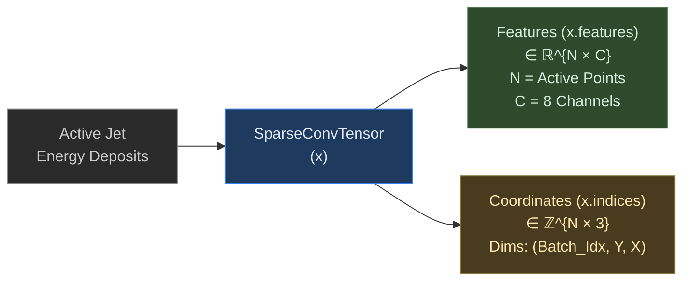
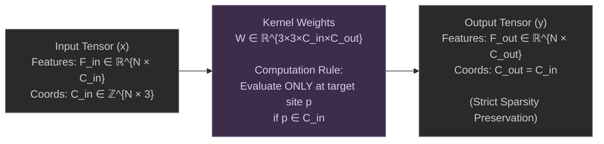
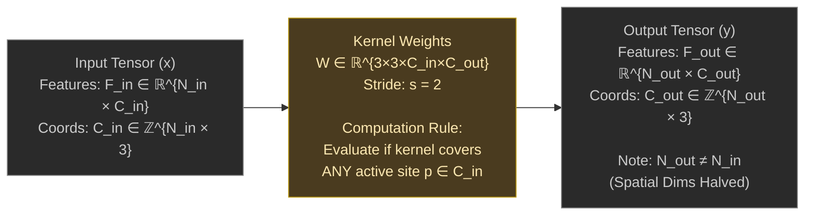
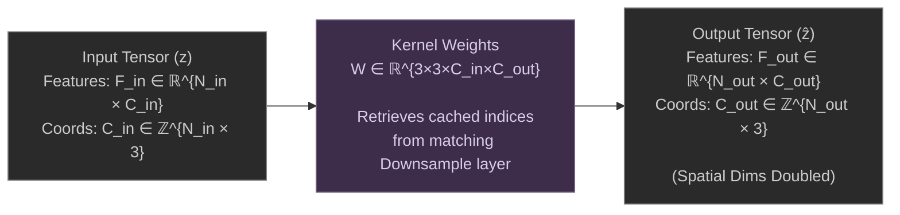
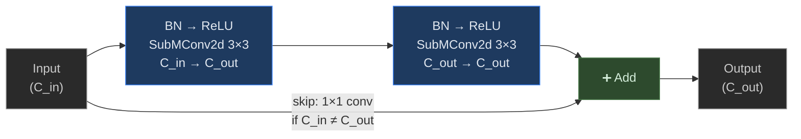
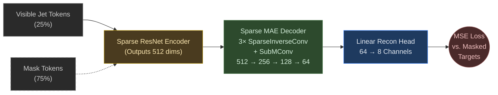
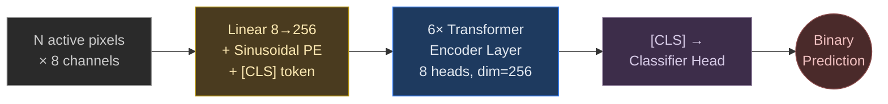

# Sparse Convolutions for Jet Classification

This directory contains all sparse convolution-based models: ResNet variants (with and without occupancy head, with SE-attention) and a Sparse Vision Transformer.

---

## Sparse Tensor Representation

CMS jet images are 125×125×8, but ~90–95% of pixels are zero. Instead of storing the full dense grid, we represent each jet as a **sparse tensor** — only the *N* active (non-zero) pixels are stored, each with its spatial coordinates and 8-channel feature vector.



This representation is the input to all sparse convolution layers via `spconv.SparseConvTensor`.

---

## Sparse Convolution Primitives

Three types of sparse convolution operations are used throughout:

### SubMConv2d — Submanifold Sparse Convolution

Computes convolution **only at existing active sites**, preserving the sparsity pattern exactly.



### SparseConv2d — Regular Sparse Convolution (Downsampling)

A strided convolution that evaluates at **any output site whose kernel covers an active input site**. Changes the sparsity pattern and halves spatial dimensions.



### SparseInverseConv2d — Inverse Sparse Convolution (Upsampling)

Reverses a previous `SparseConv2d` by reusing its cached index mappings. Used in the MAE decoder.



---

## Architectures

### SparseResBlock

Two 3×3 `SubMConv2d` layers with BatchNorm and ReLU, plus a 1×1 skip connection when channel dimensions change.



### Sparse ResNet Encoder

4-stage encoder with 2 `SparseResBlock`s per stage, interleaved with `SparseConv2d` downsamplers (stride 2). Channels: **8 → 64 → 128 → 256 → 512**.

```mermaid
flowchart LR
    IN["Input\nN×8\n125²"] --> STEM["Stem\n8→64"]
    STEM --> S1["Stage 1\n2× ResBlock\n64"]
    S1 --> D1["⬇ 64→128\nstride 2"]
    D1 --> S2["Stage 2\n2× ResBlock\n128"]
    S2 --> D2["⬇ 128→256\nstride 2"]
    D2 --> S3["Stage 3\n2× ResBlock\n256"]
    S3 --> D3["⬇ 256→512\nstride 2"]
    D3 --> S4["Stage 4\n2× ResBlock\n512"]
    S4 --> OUT["Latent\nN'×512\n16²"]

    style IN fill:#2a2a2a,stroke:#888,color:#ccc
    style STEM fill:#1e3a5f,stroke:#3b82f6,color:#e2e8f0
    style S1 fill:#1e3a5f,stroke:#3b82f6,color:#e2e8f0
    style S2 fill:#1e3a5f,stroke:#3b82f6,color:#e2e8f0
    style S3 fill:#1e3a5f,stroke:#3b82f6,color:#e2e8f0
    style S4 fill:#1e3a5f,stroke:#3b82f6,color:#e2e8f0
    style D1 fill:#4a3b1f,stroke:#b8960f,color:#fce8b2
    style D2 fill:#4a3b1f,stroke:#b8960f,color:#fce8b2
    style D3 fill:#4a3b1f,stroke:#b8960f,color:#fce8b2
    style OUT fill:#2d4a2d,stroke:#4a7a4a,color:#d4edda
```



### Pretraining Phase: Sparse MAE Reconstruction



### Fine-Tuning Phase: Jet Classification


### Squeeze-and-Excitation (SE) Variant

Adds channel attention after each residual block. Uses **3 blocks per stage**.


### Sparse ViT Variant



---

## Experiments

### ResNet_based/

| Variant | Pretraining | AUC | Accuracy | F1 | 1/FPR @ 0.7 |
|:--------|:------------|:---:|:--------:|:--:|:-----------:|
| `sparse_ResNet/` | MAE (reconstruction only) | **0.9609** | **0.904** | **0.908** | **27.4** |
| `sparse_ResNet_occupancy/` | MAE (recon + occupancy) | 0.9566 | 0.890 | 0.894 | 22.6 |
| `sparse_ResNet_se/` | MAE + SE blocks (3 blocks/stage) | 0.9420 | 0.876 | 0.881 | 17.8 |

**`sparse_ResNet/`** — The best-performing model. Pretrained with reconstruction-only MAE (75% masking, MSE loss on masked tokens).

**`sparse_ResNet_occupancy/`** — Adds an occupancy prediction head during pretraining. The occupancy loss is weighted at 0.5× relative to reconstruction. Slightly hurts downstream performance (ΔAUC = −0.0043).

**`sparse_ResNet_se/`** — Adds SE channel attention and increases to 3 blocks per stage. Despite more parameters, underperforms the simpler architecture (ΔAUC = −0.0189).

### ViT_based/

| Variant | AUC | Accuracy | F1 | 1/FPR @ 0.7 |
|:--------|:---:|:--------:|:--:|:-----------:|
| Sparse ViT (6L, 256dim, 8 heads) | 0.9426 | 0.878 | 0.881 | 15.4 |

Each active pixel is a token with 2D sinusoidal positional encoding. 6-layer transformer encoder with CLS token. Lightweight MLP decoder for MAE pretraining. Tokens capped at 1024 per sample.

---

## Training Details

### Pretraining
- 60,000 unlabelled samples, 80/20 train-val split
- AdamW, lr=1e-3, weight_decay=1e-4, cosine annealing to 1e-6
- 75% masking ratio, MSE reconstruction loss, early stopping (patience 7–10)

### Fine-Tuning
- 10,000 labelled samples, 80/20 train-val split
- **Phase 1 (epochs 1–5):** Encoder frozen, head lr=1e-3
- **Phase 2 (epochs 6+):** Full model, encoder lr=5e-5, head lr=1e-3
- Dropout 0.5, weight_decay=1e-3, BCEWithLogitsLoss, early stopping (patience 6)

---

## File Structure

Each experiment directory contains:

```
├── pretrain.py              # Self-supervised pretraining script
├── finetune.py              # Supervised fine-tuning script
├── pretrain_history.json    # Per-epoch pretraining metrics
├── finetune_history.json    # Per-epoch fine-tuning metrics
├── finetune_metrics.json    # Final evaluation summary
└── *.jpg                    # Training plots (loss, AUC, ROC, confusion matrix)
```
