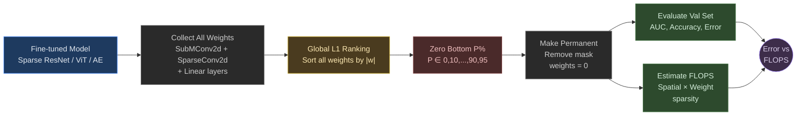

# Post-Training Pruning Analysis

Pruning experiments for three fine-tuned models, measuring the trade-off between model compression and classification performance.

---

## Method

**Global unstructured magnitude pruning** via `torch.nn.utils.prune.L1Unstructured`. All prunable weights are pooled, ranked by |w|, and the smallest are zeroed out. No retraining after pruning.



### Sparsity Levels Tested

```
Pruning ratios: [0%, 10%, 20%, 30%, 40%, 50%, 60%, 70%, 80%, 90%, 95%]
```

---

## Models Pruned

| Model | Unpruned AUC | Unpruned Accuracy | Directory |
|:------|:------------:|:-----------------:|:----------|
| **Sparse ResNet MAE** | 0.9609 | 0.904 | `sparse_resnet/` |
| **Sparse ViT MAE** | 0.9426 | 0.878 | `sparse_vit/` |
| **Sparse Autoencoder** | 0.9341 | 0.869 | `sparse_ae/` |

---

## FLOPS Estimation

FLOPS account for **two levels of sparsity**:

**Level 1 — Spatial sparsity** (inherent): sparse convolutions compute only at active sites (~1,500 of 15,625 pixels). Already ~10× cheaper than dense.

**Level 2 — Weight sparsity** (from pruning): zeroed weights skip computation. FLOPS scale linearly with density.

```
FLOPS_layer = 2 × K² × C_in × C_out × N_active × (1 − sparsity)
```

Active sites decrease through downsampling: 125² → ~1500, 63² → ~900, 32² → ~450, 16² → ~180.

---

## Results

### Sparse ResNet MAE (Best Model)

<p align="center">
  
</p>

### Sparse ViT MAE

<p align="center">
  
</p>

### Sparse Autoencoder (L1 + KL)

<p align="center">
  
</p>

### Combined Comparison

<p align="center">
  
  <br/>
  <em>Error (1 − Accuracy) vs. estimated GFLOPS across pruning ratios. Sparse ResNet MAE dominates at every FLOPS budget.</em>
</p>

---

## Key Observations

1. **High tolerance to pruning** — all models maintain near-baseline accuracy up to ~50% weight sparsity.

2. **Graceful degradation** — performance drops smoothly, sharpest between 80–95% sparsity.

3. **Double sparsity** — spatial sparsity (sparse convs on ~10% active pixels) + weight sparsity (pruning) means a 50%-pruned model uses ~20× fewer FLOPS than a dense unpruned equivalent.

4. **No retraining** — all results are one-shot pruning. Iterative pruning + retraining could improve further.

---

## File Structure

```
pruning/
├── README.md
├── sparse_resnet/
│   ├── prune_sparse_resnet.py
│   ├── sparse_resnet_pruning_results.json
│   └── sparse_resnet_error_vs_flops.png
├── sparse_vit/
│   ├── prune_sparse_vit.py
│   ├── sparse_vit_pruning_results.json
│   └── sparse_vit_error_vs_flops.png
└── sparse_ae/
    ├── prune_sparse_ae.py
    ├── sparse_ae_pruning_results.json
    └── sparse_ae_error_vs_flops.png
```

### Running

```bash
python pruning/sparse_resnet/prune_sparse_resnet.py
python pruning/sparse_vit/prune_sparse_vit.py
python pruning/sparse_ae/prune_sparse_ae.py
```

Requires GPU and access to fine-tuned checkpoints + dataset.
